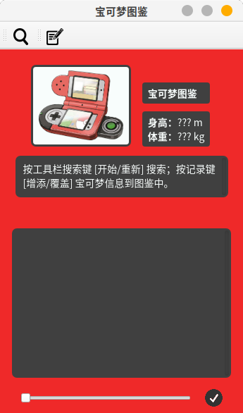
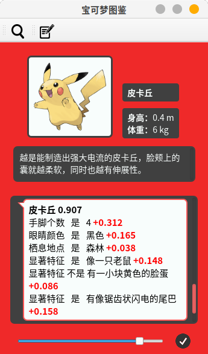
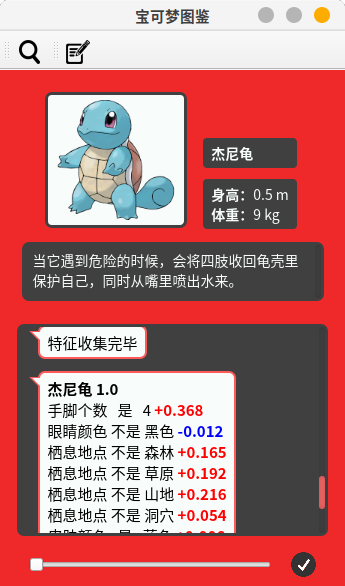
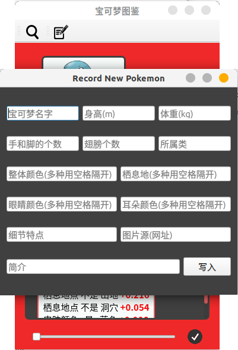

## 简介

一个通过问答识别精灵宝可梦(Pokémon)的专家系统

基于框架、不确定性管理、决策树


## 运行方法

```
python3 app.py
```

按工具栏搜索键 [开始/重新] 搜索；按记录键 [增添/覆盖] 宝可梦信息到图鉴中。


## 效果展示

* 预测皮卡丘

        

     

  

* 预测杰尼龟

        

        

  

* 开发人员界面

  

  专家等开发人员可以轻松方便地在开发人员界面中输入新增宝可梦的特征信息，从而拓展专家系统的知识库。
